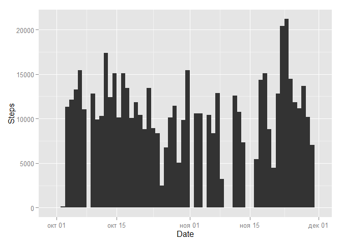
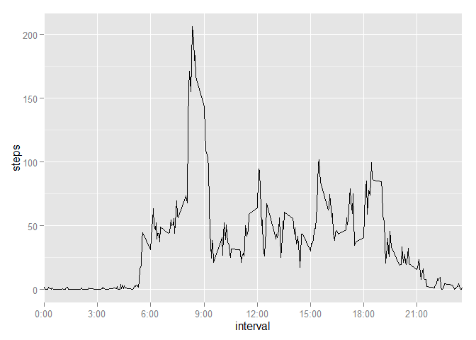
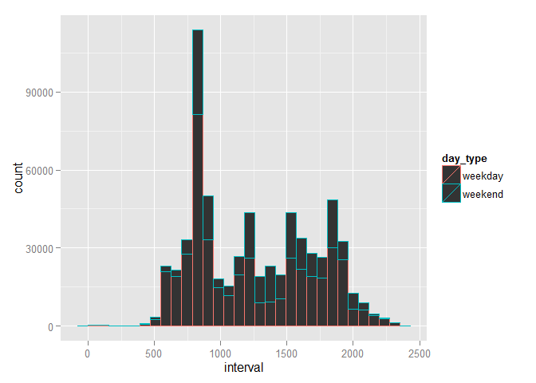

# Reproducible Research: Peer Assessment 1

##Introduction
It is now possible to collect a large amount of data about personal movement
using activity monitoring devices such as a Fitbit, Nike Fuelband, or Jawbone
Up. These type of devices are part of the “quantified self” movement – a group
of enthusiasts who take measurements about themselves regularly to improve
their health, to find patterns in their behavior, or because they are tech geeks.
But these data remain under-utilized both because the raw data are hard to
obtain and there is a lack of statistical methods and software for processing and
interpreting the data.

##Data

The variables included in this dataset are:
• steps: Number of steps taking in a 5-minute interval (missing values are
coded as NA)
• date: The date on which the measurement was taken in YYYY-MM-DD
format
• interval: Identifier for the 5-minute interval in which measurement was
taken
The dataset is stored in a comma-separated-value (CSV) file and there are a
total of 17,568 observations in this dataset.

#Research
First of all I loaded and procesed data 

```r
activity = read.csv(unz("activity.zip", "activity.csv"), 
                colClasses = c("integer", "character", "integer" ))

activity = transform(activity, date = as.Date(date, "%Y-%m-%d"))
```

Now I can unswer questions below

## What is mean total number of steps taken per day?

Lets see the amount of steps made each day of research. For this time NA's are ignored

```r
library("ggplot2")
ggplot(activity, aes(x=date)) +
  geom_histogram( aes(weight = steps), binwidth = 1) +
  labs (aes(y = "Steps", x = "Date"))
```

 

Also looked at avereges 

```r
steps_p_day = tapply(activity$steps, activity$date, sum, na.rm = TRUE)
mean = mean(steps_p_day)
median = median(steps_p_day)
```
where mean is 9354.2295082 and median is 10395 which shows that steps distribution is left sqweted

## What is the average daily activity pattern?
Continuing discribing data lets find if there some patern in daily activity for oserved data

```r
steps_p_inter = tapply(activity$steps, activity$interval,
                       mean, na.rm = TRUE)
steps_p_inter = data.frame(interval = as.integer(names(steps_p_inter)), 
                           steps = steps_p_inter)

#calculate breaks and labes to time in human readeble format
breaks = seq(0, to = 2400, by = 300)
labels = paste(as.character(breaks/100), ":00", sep="")

ggplot(steps_p_inter,aes(interval, steps)) +
         geom_line() +
          scale_x_discrete (breaks = breaks, labels = labels)
```

 

The plot show patern that in night peolpe don't move and have peak activity in 5 minute interval at

```r
max_activity = with(steps_p_inter,
    steps_p_inter[steps == max(steps), "interval"])
paste(max_activity%/%100, max_activity%%100, sep = ":") 
```

```
## [1] "8:35"
```

## Imputing missing values
First find out how much data is absent

```r
ebsent_val = nrow(activity[is.na(activity$steps), ])
ebsent_per = ebsent_val/nrow(activity) * 100
ebsent_val
```

```
## [1] 2304
```
This is 13.1147541 of all records  

It is quite a lot so missing values should be filled. For this task I changed all NA's with with mean of step for apropriate interval

```r
n_activity = merge(activity, steps_p_inter, by="interval")

n_activity[is.na(n_activity$steps.x), ]$steps.x = 
  n_activity[is.na(n_activity$steps.x), ]$steps.y
```

Lets plot old data with filled data

```r
a = 2
```
## Are there differences in activity patterns between weekdays and weekends?
It is interesting to see if there is any difference weekdays and weekends. First of all mark each type of days

```r
#get day number
week_day = as.POSIXlt(n_activity$date)$wday

n_activity$day_type = "weekend"
n_activity[week_day <= 4, ]$day_type = "weekday"
```

and see which patterns have each type fo data

```r
ggplot(n_activity, aes(interval, colour = day_type)) + 
  geom_histogram(aes(weight = steps.x))
```

```
## stat_bin: binwidth defaulted to range/30. Use 'binwidth = x' to adjust this.
```

 

As we can see on weekends people makes more steps and become active later and stop activity later
